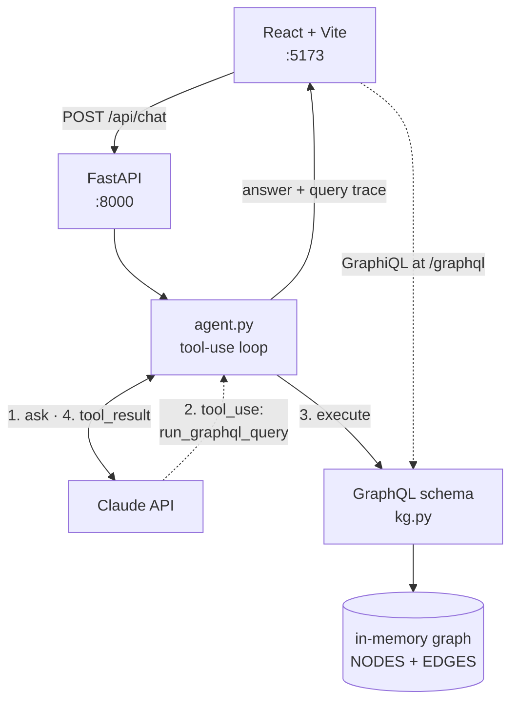
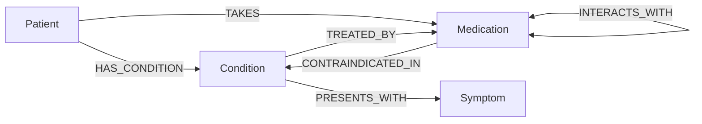

# Medical KG Chatbot

A minimal reference implementation of a **chatbot whose answers are grounded in a
knowledge graph** instead of in the model's own recall.

Claude is given exactly one tool, `run_graphql_query`, plus a system prompt that
forbids answering from memory. To say anything at all about a condition, drug or
patient, it has to query a real GraphQL schema over a medical knowledge graph
first. The UI then shows you the queries it ran under every answer, so you can
check the reasoning against the data yourself.

About 600 lines end to end. Python + FastAPI on the backend, React + Vite on the
front, no database.

## How it fits together



The loop repeats steps 1 to 4 until Claude stops asking for queries and writes an
answer. Every query and result is collected into a **trace** that ships with the
answer and renders in a collapsible panel beneath it.

The tool's description is generated from the schema (`schema.as_str()`) rather
than hand-written. Add a field to `kg.py` and the agent knows about it on the
next request, with no prompt to keep in sync.

## What's in the graph

Four entity types, six relations, all defined at the top of
`backend/app/kg.py`:



Five conditions, seven symptoms, seven medications and three fictional patients:
small enough to read through in a few minutes.

## Setup

Prerequisites: Python 3.10+, Node 18+, and an
[Anthropic API key](https://console.anthropic.com/settings/keys).

**Backend** (terminal 1):

```bash
cd backend
python3 -m venv .venv
source .venv/bin/activate          # Windows: .venv\Scripts\activate
pip install -r requirements.txt

cp .env.example .env               # then edit .env and paste in your API key

python smoke_test.py               # checks the graph, no API key needed
uvicorn app.main:app --reload
```

**Frontend** (terminal 2):

```bash
cd frontend
npm install
npm run dev
```

Open <http://localhost:5173>.

If something misbehaves: <http://localhost:8000/api/health> reports whether your
key was picked up, and <http://localhost:8000/graphql> is a GraphiQL playground
on the very same schema the agent uses.

## Try it

```
Which conditions cause fatigue?
Patient P-002 is on several medications. Anything to watch for?
Is anything Ada Whitfield takes risky given her conditions?
What treats lupus?
```

The last three are the interesting ones. Two findings are reachable *only* by
traversing the graph. Neither is visible on any single node:

- **P-002** takes warfarin *and* ibuprofen, which the graph records as interacting.
- **P-001 (Ada Whitfield)** has CKD stage 3 and takes metformin, which is marked
  contraindicated in that condition.

Lupus, meanwhile, isn't in the graph at all, so that question shows the other
half of grounding: the agent should tell you it has no entry rather than
answering from general knowledge. Test that behaviour when you swap in your own
data.

## The grounding loop, step by step

1. The frontend POSTs the whole conversation to `/api/chat`. The backend is
   stateless; the client owns the history.
2. `agent.py` calls Claude with the system prompt and the one tool, whose
   description embeds the schema SDL.
3. Claude replies with a `tool_use` block containing a GraphQL query.
4. The backend runs it with `schema.execute_sync()` and appends the JSON as a
   `tool_result`. A malformed query comes back as a tool *error* carrying the
   GraphQL parser's message, so Claude can correct itself and retry.
5. Repeat until Claude answers in prose, capped at `MAX_ITERATIONS = 6`.

## Layout

```
backend/
  .env.example      ANTHROPIC_API_KEY, optional ANTHROPIC_MODEL
  requirements.txt  five dependencies
  smoke_test.py     verifies the graph, no API key needed
  app/
    kg.py           data → indices → GraphQL schema, in that order
    agent.py        the Claude tool-use loop and trace capture
    main.py         FastAPI: /api/chat, /api/health, /graphql
frontend/
  vite.config.js    proxies /api and /graphql to :8000
  src/App.jsx       chat UI and the query-trace panel
```

## Extending it

**Add an entity type.** Append to `NODES` and `EDGES`, add a `@strawberry.type`
and a root field, all in `kg.py`. The agent picks it up automatically, because
its tool description *is* the schema.

**Use a real graph database.** Only `neighbors()` and `find()` touch storage.
Reimplement those two functions with Cypher or Gremlin and nothing else changes.

**Let the SDK drive the loop.** `agent.py` runs the loop by hand so each step is
visible. In production you'd likely use
`client.beta.messages.tool_runner` with an `@beta_tool`-decorated function. You'd
just need another way to capture the trace.

**Stream the response.** `/api/chat` returns one JSON blob, so the UI shows a
spinner while the agent works. `client.messages.stream()` behind Server-Sent
Events would let you show queries as they're issued.

**Cache the prompt.** The system prompt and tool schema are identical on every
request; adding `cache_control` cuts input cost on multi-turn conversations. It
only kicks in once the cached prefix passes the model's minimum, so check
`usage.cache_read_input_tokens` to confirm it's actually working.

## Notes

The medical data is fictional, simplified, and assembled for the demo. It is not
clinically complete and is not medical advice.
